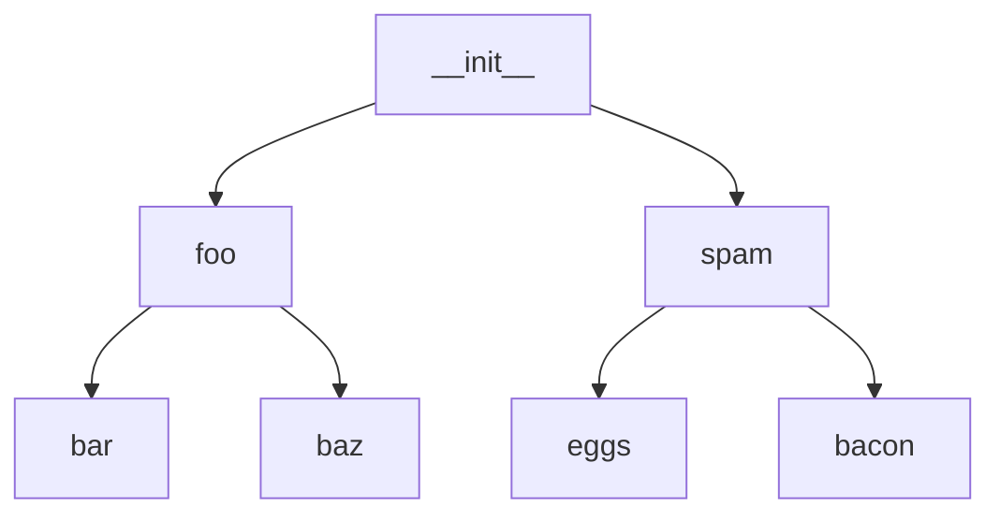

# argo

> Утилита для манипулирования состоянием Sync для argo в стиле Apps of Apps



## Пример

```shell
pl-cli --tool argo --context ${ctx} --no-sync --sync-app 'bacon'
```

Последовательно выключит: `__init__`, `spam`, `bacon` и приложения за ним можно будет обслуживать. После работ следует вернуть все назад:

```shell
pl-cli --tool argo --context ${ctx} --sync --sync-app '__init__'
```

## [home](../README.md)
